From Aug. 2, 2021, to August 22, 2021, UT's policy was for masks to be worn in classrooms, labs, and during indoor mandatory training events. Spaces like hallways, dining halls, elevators, and libraries were not included in this requirement, in contrast to the CDC's recommendations in order to **protect others and themselves** by wearing masks in all indoor spaces. On Aug. 23, 2021, UT instituted a mask mandate in all indoor spaces except for private indoor spaces, dining, and other limited exceptions. Unlike [over 650 other colleges and universities](https://www.chronicle.com/blogs/live-coronavirus-updates/heres-a-list-of-colleges-that-will-require-students-to-be-vaccinated-against-covid-19), UTK has no vaccination mandate in general (there may be exceptions in particular areas, like nursing with high patient contact). According to an [Aug. 2 notice by the Chancellor](https://chancellor.utk.edu/2021/08/02/updated-covid-guidelines/), the university will no longer be requesting saliva testing to track spread (though testing kits are available in the student health center). I do not know of data on vaccination rate at UTK; a rough estimate may come from LSU, which as of [Aug. 2 had a 34% vaccination rate among students](https://www.washingtonpost.com/education/2021/08/06/college-covid-vaccines-student-rates/).

UT is holding various events and messaging at the start of the school year. These are images from leaders' or university accounts. 

[August 29, 2021](https://twitter.com/DondePlowman/status/1432085716381667336)

```{r, fig.alt = "Vol is a verb day photos", out.width="400px", echo=FALSE, message=FALSE, warning=FALSE}
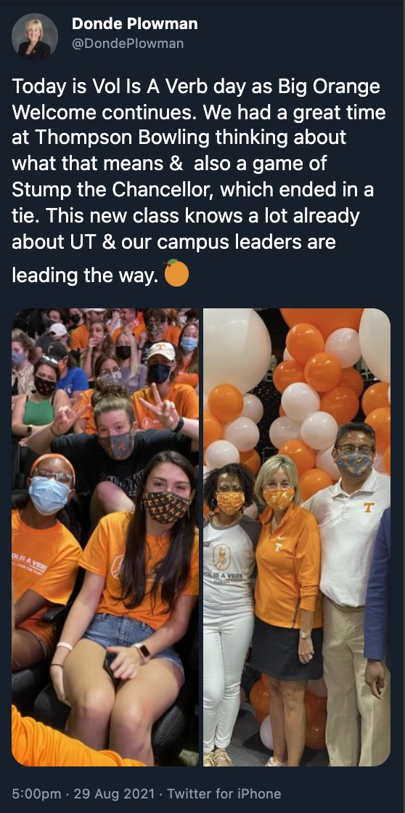
```


[August 20, 2021](https://twitter.com/DondePlowman/status/1428671118446112770)

```{r, fig.alt = "Chancellor Plowman with two students in Chancellor's office", out.width="400px", echo=FALSE, message=FALSE, warning=FALSE}
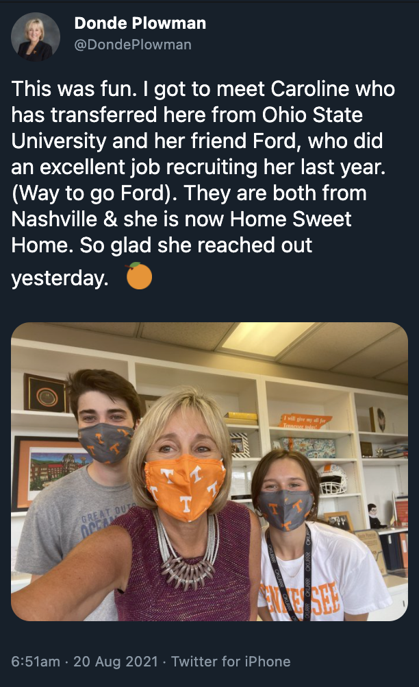
```


[August 17, 2021](https://twitter.com/UTKLibraries/status/1427648231224315920)

```{r, fig.alt = "Dean Smith, Chancellor Plowman, and various masked students", out.width="400px", echo=FALSE, message=FALSE, warning=FALSE}
knitr::include_graphics("Aug17_2021b.png")
```


[August 17, 2021](https://twitter.com/VOLNursingDEAN/status/1427693307690369024)

```{r, fig.alt = "Freshmen in College of Nursing welcome", out.width="400px", echo=FALSE, message=FALSE, warning=FALSE}
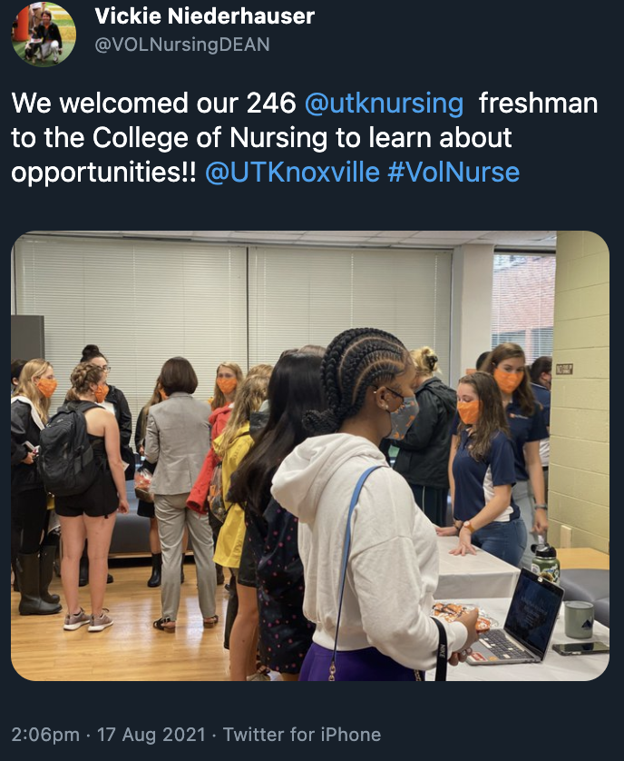
```


[August 17, 2021](https://twitter.com/DondePlowman/status/1427582136891191296)

```{r, fig.alt = "Students at Torchnight ceremony in Neyland stadium", out.width="400px", echo=FALSE, message=FALSE, warning=FALSE}
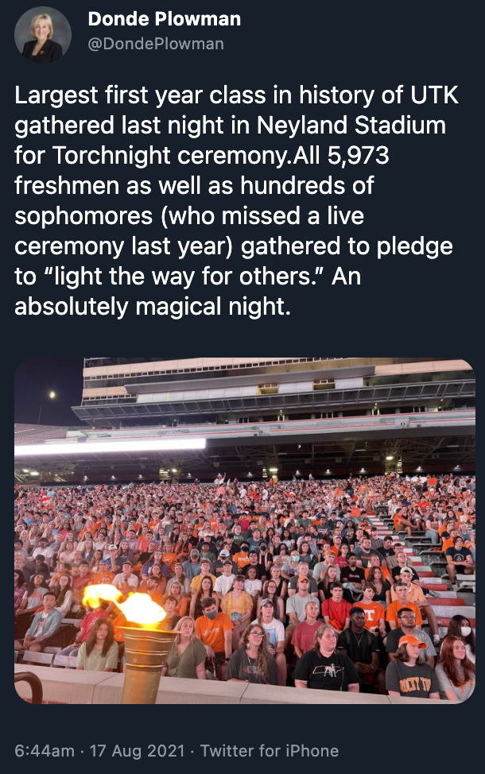
```


[August 16, 2021](https://twitter.com/VOLNursingDEAN/status/1427326318002249734)

```{r, fig.alt = "UT Nursing Training", out.width="400px", echo=FALSE, message=FALSE, warning=FALSE}
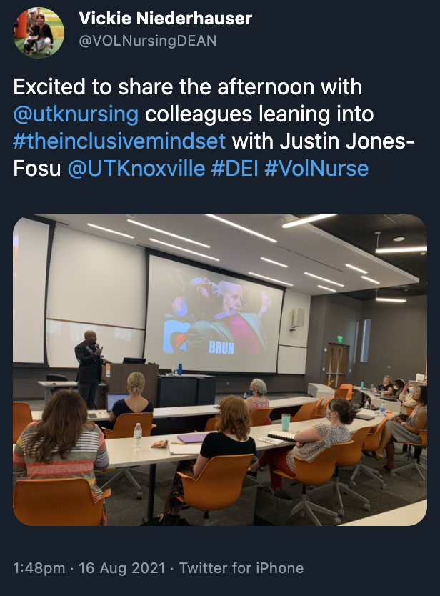
```


[August 14, 2021](https://twitter.com/ambers_williams/status/1426713825831702531)

```{r, fig.alt = "UT Silent Disco", out.width="400px", echo=FALSE, message=FALSE, warning=FALSE}
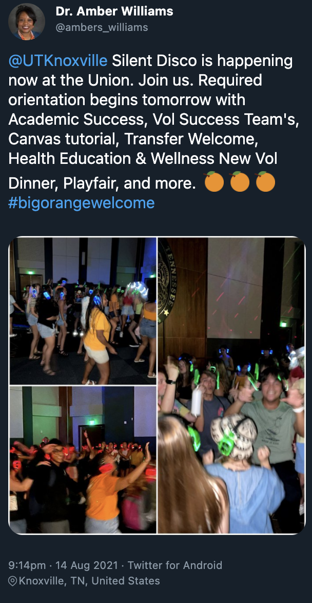
```


[August 13, 2021](https://twitter.com/DondePlowman/status/1426326333819277313)

```{r, fig.alt = "UT Band at Neyland Stadium (I'm not sure if this space is indoors or outdoors)", out.width="400px", echo=FALSE, message=FALSE, warning=FALSE}
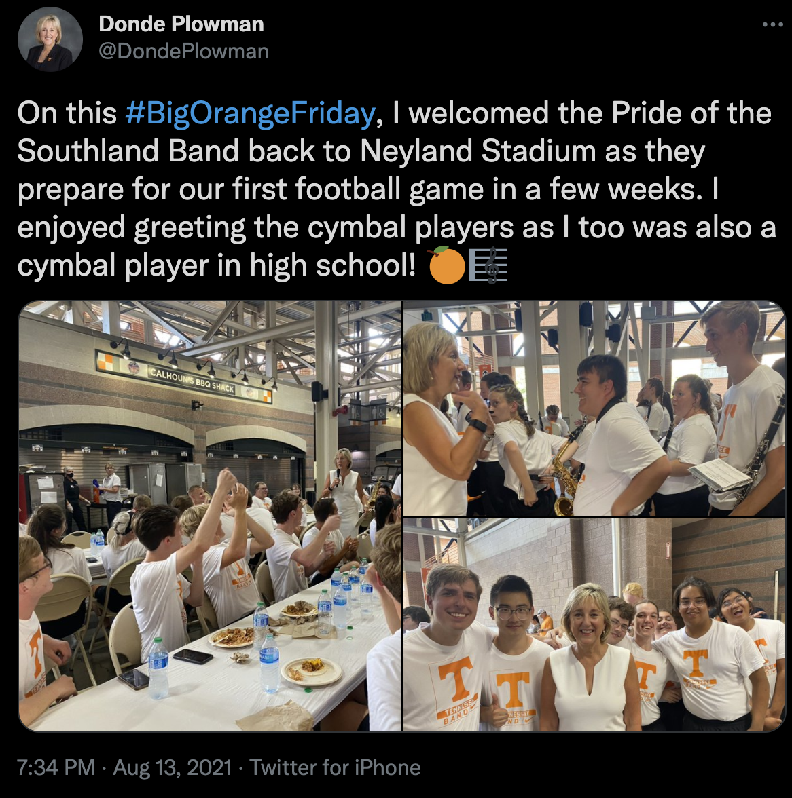
```

[August 12, 2021](https://twitter.com/DondePlowman/status/1425841621929693191)

```{r, fig.alt = "UT Success Academy group photos", out.width="400px", echo=FALSE, message=FALSE, warning=FALSE}
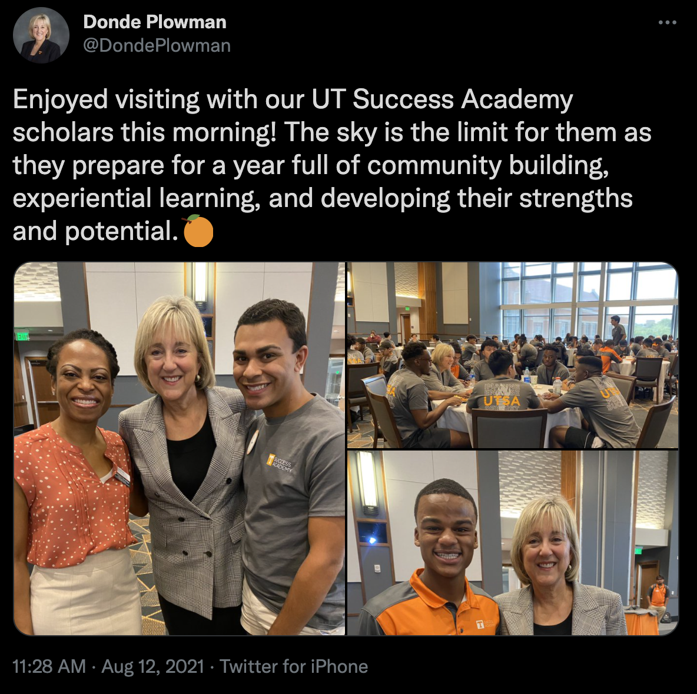
```

[August 12, 2021](https://twitter.com/ambers_williams/status/1425738153718173696)

```{r, fig.alt = "UT Student Life welcome", out.width="400px", echo=FALSE, message=FALSE, warning=FALSE}
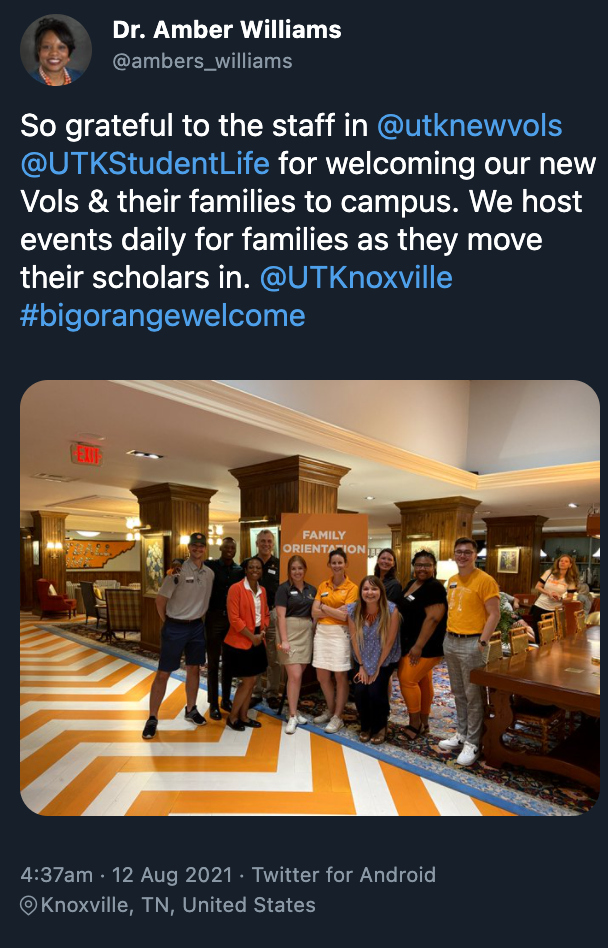
```


[August 9, 2021](https://twitter.com/UTKnoxville/status/1424836616871370754)

```{r, fig.alt = "Guidance for masks", out.width="400px", echo=FALSE, message=FALSE, warning=FALSE}
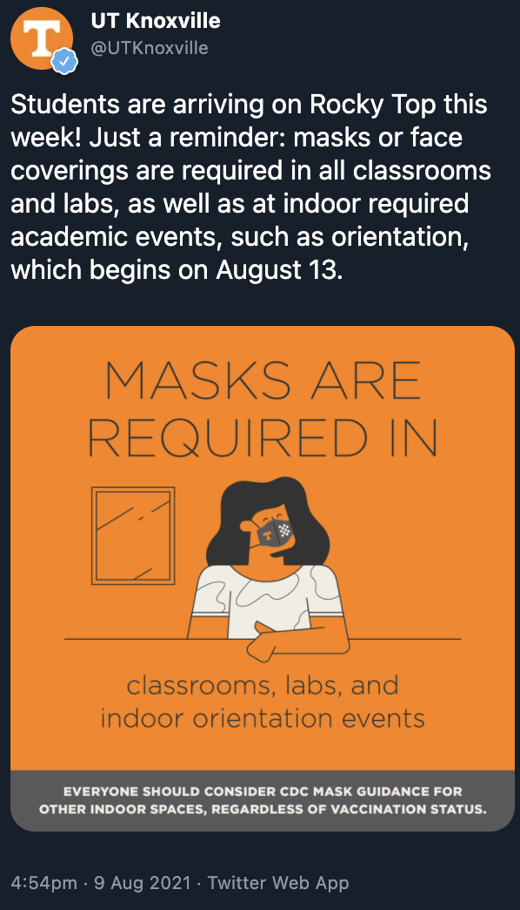
```

[August 9, 2021](https://twitter.com/DondePlowman/status/1424690558644142081)

```{r, fig.alt = "Chancellor Plowman with staff member Sheila Burchfield-Bishop", out.width="400px", echo=FALSE, message=FALSE, warning=FALSE}
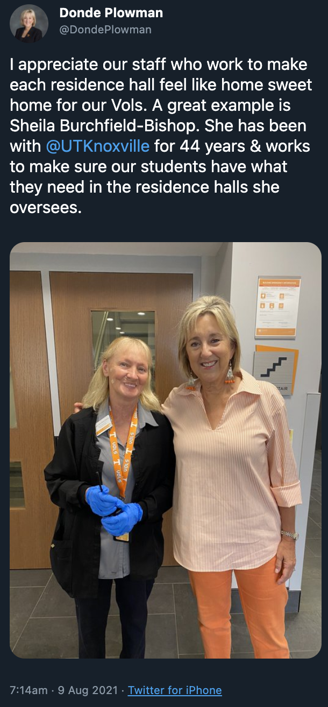
```
